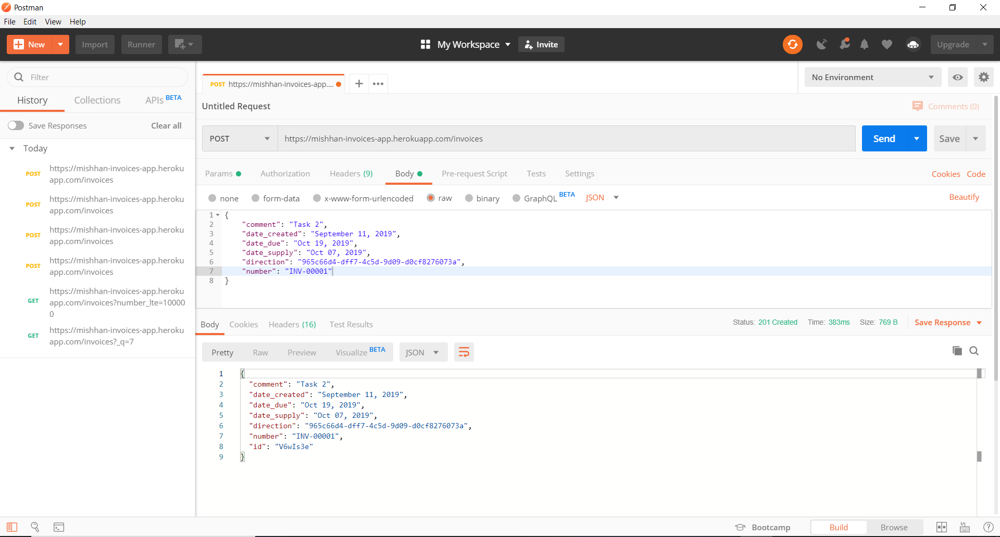
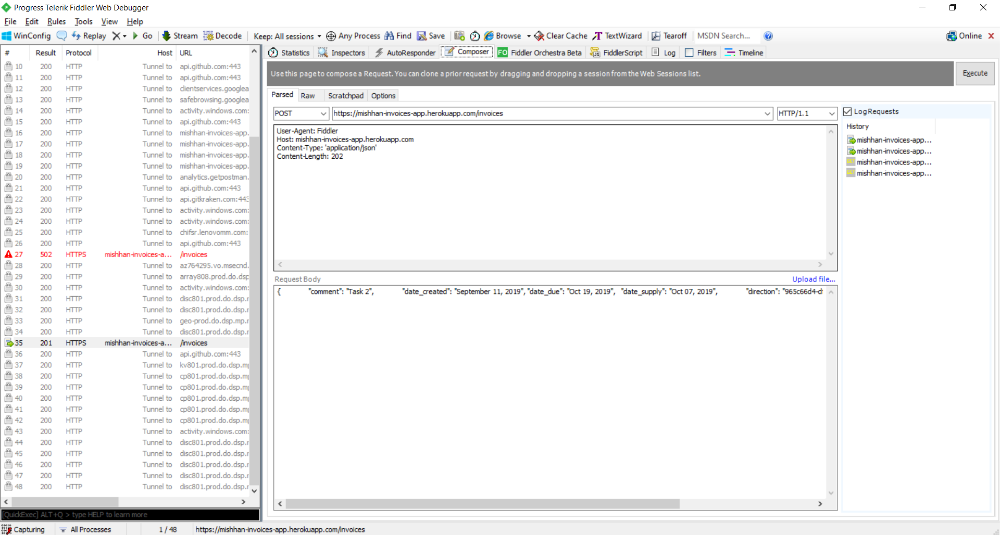
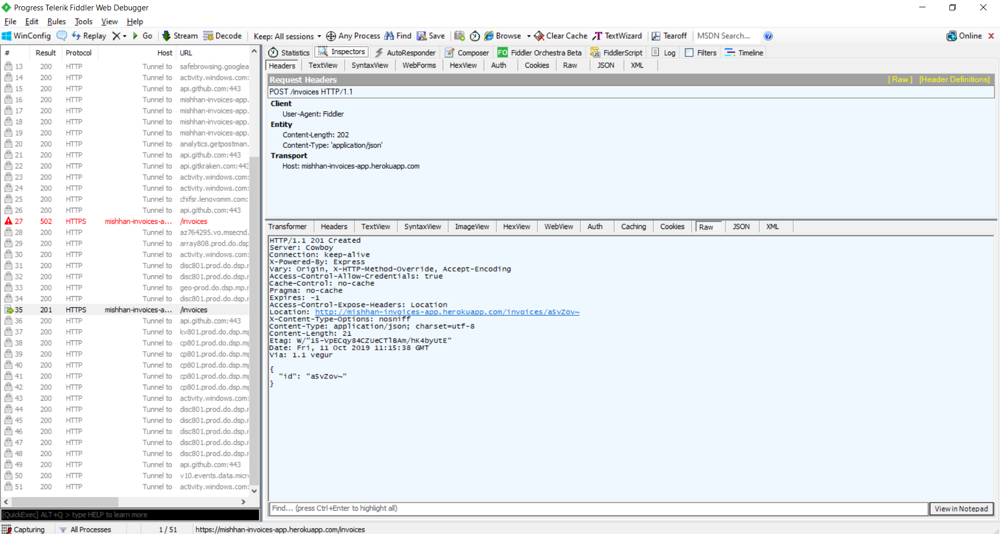
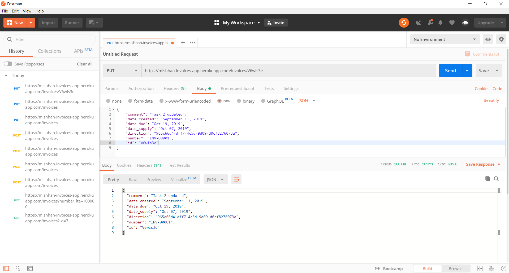
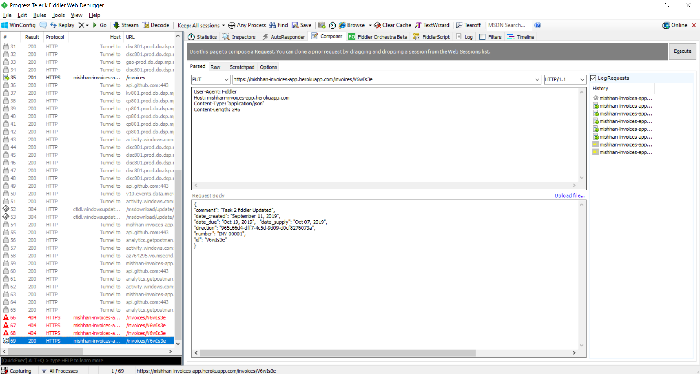
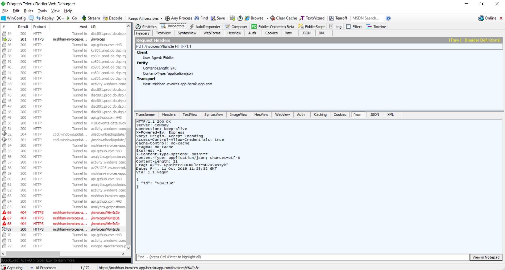
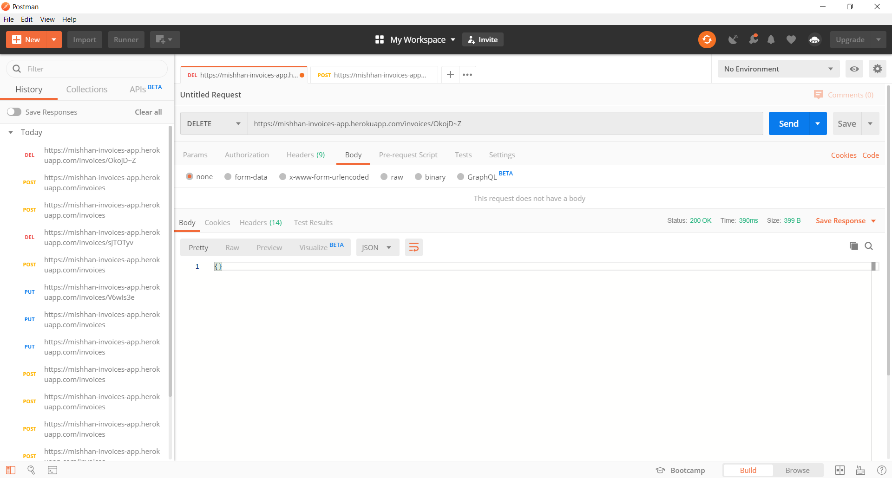
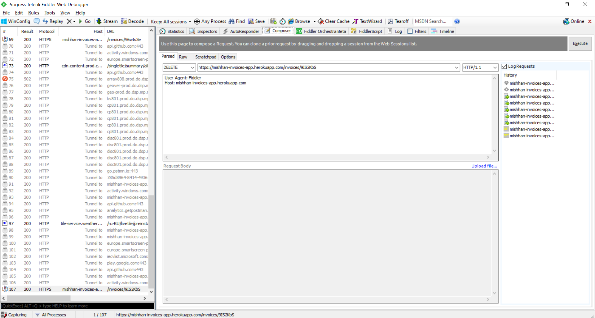
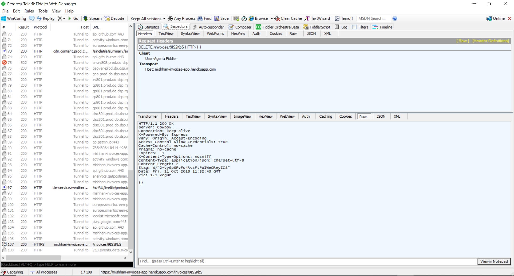

# 2

## Create invoice

### Postman

### Fiddler Request

### Fiddler Response

## Update invoice

### Postman

### Fiddler Request

### Fiddler Response

## Delete invoice

### Postman

### Fiddler Request

### Fiddler Response

