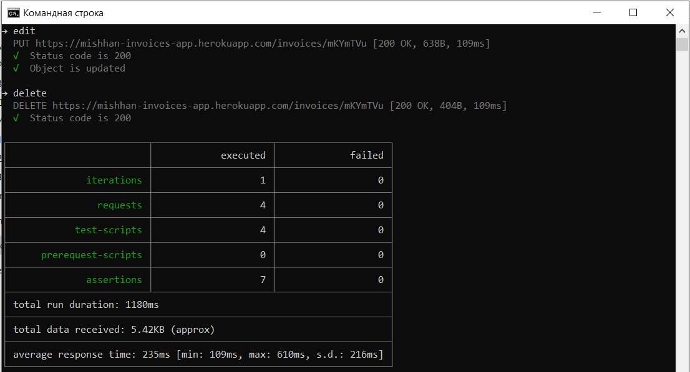
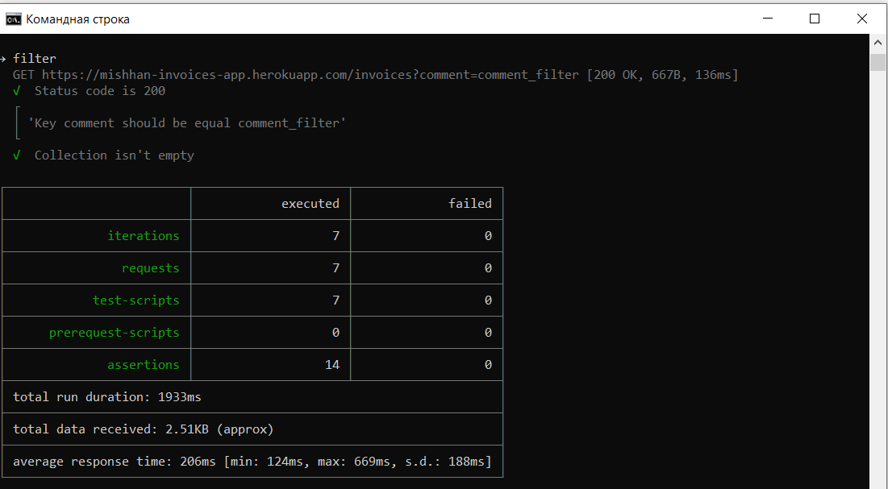

# 3

## The minimum test suite in the first collection:

1. Test for receiving all invoices
2. Test for adding invoices
3. Test for changing invoices
4. The invoice removal test

[Solution](./CRUD.postman_collection.json)

## The minimum test suite in the second collection:

### Test for receiving invoices filtered by field value. The field name and its value must be specified in environment variables. For this test, prepare a file with a JSON array of values of environment variables - each field of the invoice must have one element of the array (i.e., data should be prepared for filtering by the value of each field).

[Solution](./CollectionFilter.postman_collection.json)

[Data](./test_data.json)

